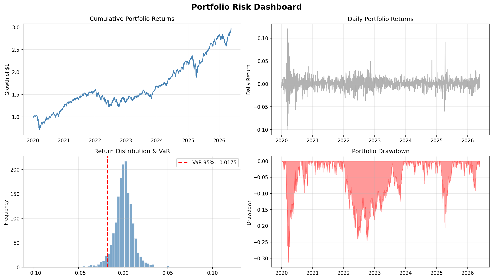

# Portfolio Risk Dashboard

## Overview
A Python-based risk analytics dashboard analyzing a diversified 5-asset portfolio 
(SPY, AAPL, JPM, GS, BND) using live market data from Yahoo Finance.

## Risk Metrics Calculated
- **Sharpe Ratio:** 0.70
- **Sortino Ratio:** 0.91
- **Daily VaR (95%):** -$1,746 on a $100,000 portfolio
- **Max Drawdown:** -31.21%

## Dashboard

## Key Findings
- Portfolio grew approximately 2.9x from January 2020 to present
- Max drawdown of 31.21% occurred during the COVID-19 market crash in Q1 2020
- Sortino Ratio exceeds Sharpe Ratio, indicating upside volatility exceeds downside 
  volatility — a favorable risk profile
- VaR reflects elevated equity volatility during stress periods including COVID (2020) 
  and Fed rate hikes (2022)

## Tools & Libraries
- Python (pandas, numpy, matplotlib, yfinance)
- Jupyter Notebook

## Methodology
Daily returns calculated via percentage change on closing prices. VaR estimated using 
historical simulation at 95% confidence. Sharpe and Sortino ratios annualized using 
252 trading days. Max drawdown calculated as maximum peak-to-trough decline in 
cumulative returns.
